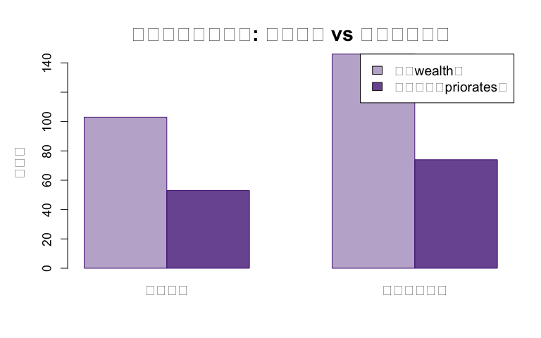
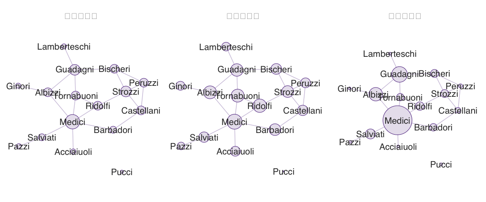
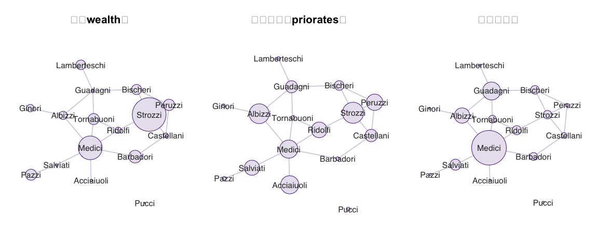
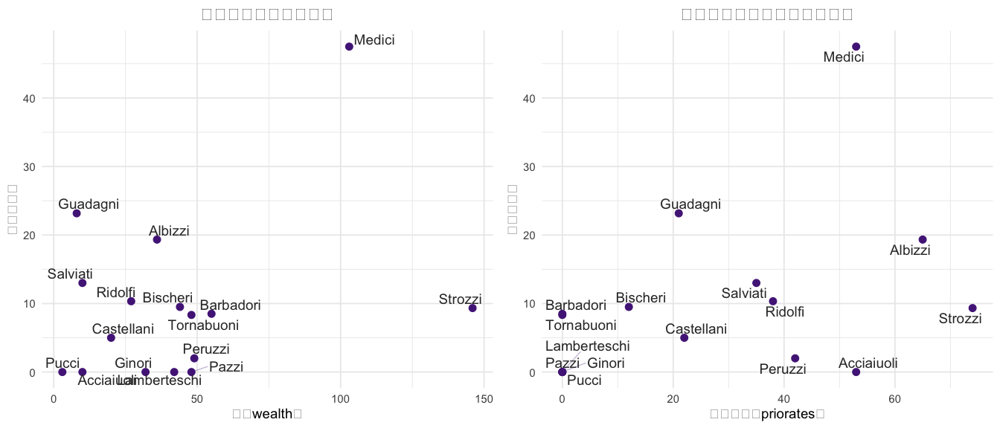
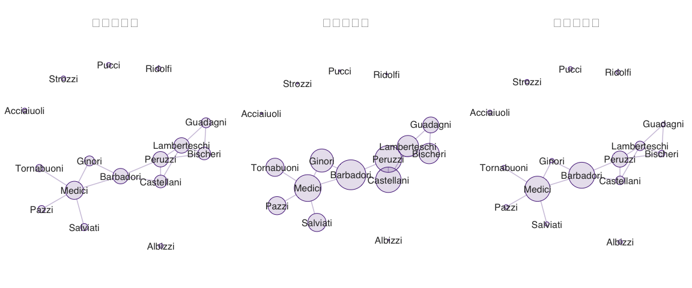
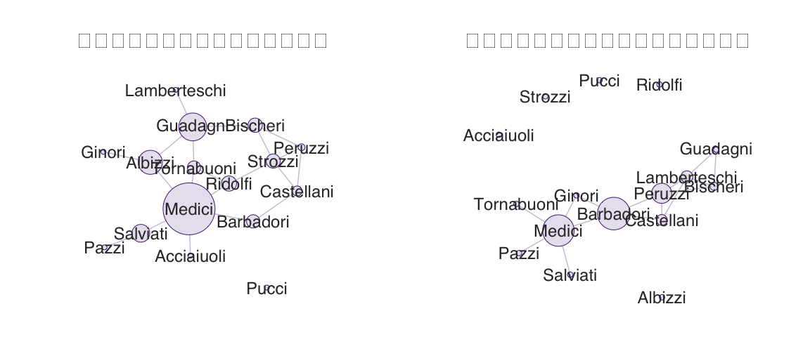
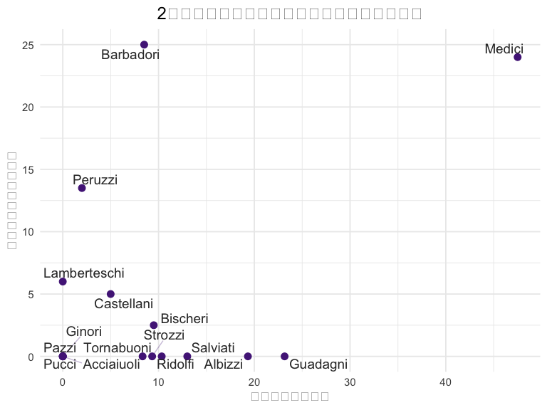
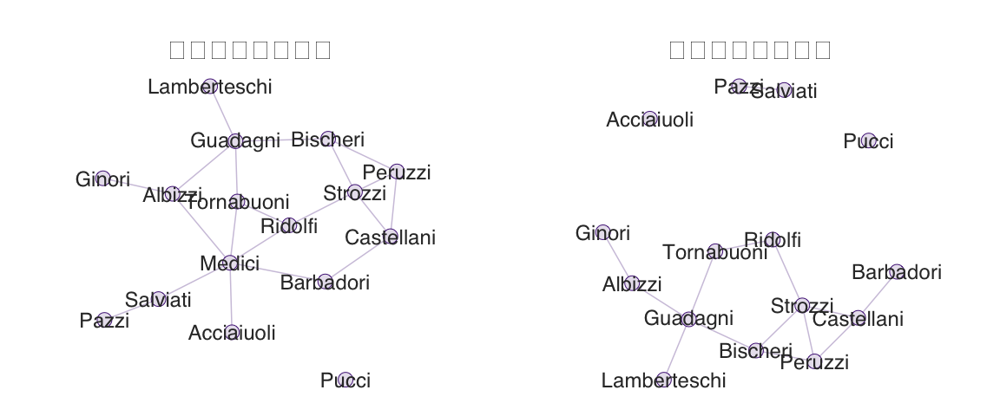
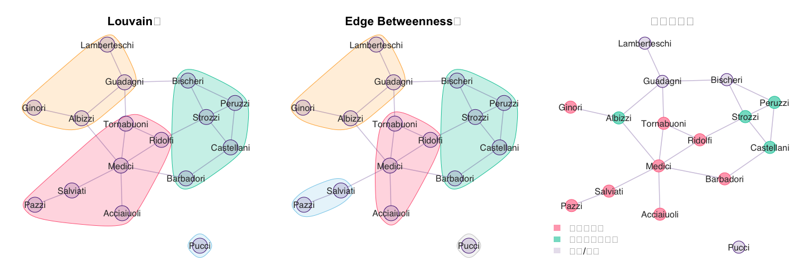

Padgett & Ansell (1993) Robust Action and the Rise of the Medici —
再現と拡張分析
================
最終修正: 2026-04-20

- [1. データの読み込み](#1-データの読み込み)
  - [データの外観](#データの外観)
    - [婚姻ネットワーク](#婚姻ネットワーク)
    - [ビジネスネットワーク](#ビジネスネットワーク)
    - [各家の属性データ](#各家の属性データ)
  - [メディチ家 vs ストロッツィ家 —
    個別の属性の比較](#メディチ家-vs-ストロッツィ家--個別の属性の比較)
  - [igraph形式に変換](#igraph形式に変換)
- [2. 婚姻ネットワーク —
  QSSの復習と拡張](#2-婚姻ネットワーク--qssの復習と拡張)
  - [2.1
    基本的な中心性指標（QSSで実施済み）](#21-基本的な中心性指標qssで実施済み)
  - [2.2 3つの中心性指標の可視化](#22-3つの中心性指標の可視化)
  - [2.3 可視化 —
    富・政治参加・媒介中心性の比較](#23-可視化--富政治参加媒介中心性の比較)
  - [2.3
    富・政治参加と媒介中心性の関係](#23-富政治参加と媒介中心性の関係)
- [3. ビジネスネットワーク —
  教科書にない分析](#3-ビジネスネットワーク--教科書にない分析)
  - [3.1 ビジネスネットワークの中心性](#31-ビジネスネットワークの中心性)
  - [3.2
    ビジネスネットワークの3つの中心性指標](#32-ビジネスネットワークの3つの中心性指標)
  - [3.3 婚姻 vs ビジネスの比較可視化](#33-婚姻-vs-ビジネスの比較可視化)
  - [3.4
    婚姻とビジネスの媒介中心性の比較](#34-婚姻とビジネスの媒介中心性の比較)
  - [3.5
    婚姻とビジネスで繋がる相手の違い](#35-婚姻とビジネスで繋がる相手の違い)
    - [3家の比較まとめ](#3家の比較まとめ)
- [4. メディチ家の構造的重要性 —
  ノード除去シミュレーション](#4-メディチ家の構造的重要性--ノード除去シミュレーション)
- [5. コミュニティ検出 —
  派閥構造の自動検出](#5-コミュニティ検出--派閥構造の自動検出)
  - [5.2 歴史的派閥との照合](#52-歴史的派閥との照合)
- [6. まとめ — 数値で見る「メディチ vs
  ストロッツィ」](#6-まとめ--数値で見るメディチ-vs-ストロッツィ)

# 1. データの読み込み

QSSでは `florentine.csv`（婚姻ネットワークのみ）を使用した。 `ergm`
パッケージには、Padgett & Ansell (1993)
のデータが組み込みデータセットとして収録されており、
**婚姻**・**ビジネス**の2種類のネットワークに加え、各家の属性データも利用可能。

``` r
library(ergm)
```

    ## Warning: package 'ergm' was built under R version 4.5.2

    ## Loading required package: network

    ## Warning: package 'network' was built under R version 4.5.2

    ## 
    ## 'network' 1.20.0 (2026-02-06), part of the Statnet Project
    ## * 'news(package="network")' for changes since last version
    ## * 'citation("network")' for citation information
    ## * 'https://statnet.org' for help, support, and other information

    ## 
    ## 'ergm' 4.12.0 (2026-02-17), part of the Statnet Project
    ## * 'news(package="ergm")' for changes since last version
    ## * 'citation("ergm")' for citation information
    ## * 'https://statnet.org' for help, support, and other information

    ## 'ergm' 4 is a major update that introduces some backwards-incompatible
    ## changes. Please type 'news(package="ergm")' for a list of major
    ## changes.

``` r
library(igraph)
```

    ## Warning: package 'igraph' was built under R version 4.5.2

    ## 
    ## Attaching package: 'igraph'

    ## The following objects are masked from 'package:network':
    ## 
    ##     %c%, %s%, add.edges, add.vertices, delete.edges, delete.vertices,
    ##     get.edge.attribute, get.edges, get.vertex.attribute, is.bipartite,
    ##     is.directed, list.edge.attributes, list.vertex.attributes,
    ##     set.edge.attribute, set.vertex.attribute

    ## The following objects are masked from 'package:stats':
    ## 
    ##     decompose, spectrum

    ## The following object is masked from 'package:base':
    ## 
    ##     union

``` r
data(florentine)
```

## データの外観

### 婚姻ネットワーク

16のフィレンツェの名家について、家同士の婚姻関係を1（あり）/
0（なし）で記録した隣接行列。

``` r
marriage.mat <- as.matrix.network(flomarriage)
marriage.mat
```

    ##              Acciaiuoli Albizzi Barbadori Bischeri Castellani Ginori Guadagni
    ## Acciaiuoli            0       0         0        0          0      0        0
    ## Albizzi               0       0         0        0          0      1        1
    ## Barbadori             0       0         0        0          1      0        0
    ## Bischeri              0       0         0        0          0      0        1
    ## Castellani            0       0         1        0          0      0        0
    ## Ginori                0       1         0        0          0      0        0
    ## Guadagni              0       1         0        1          0      0        0
    ## Lamberteschi          0       0         0        0          0      0        1
    ## Medici                1       1         1        0          0      0        0
    ## Pazzi                 0       0         0        0          0      0        0
    ## Peruzzi               0       0         0        1          1      0        0
    ## Pucci                 0       0         0        0          0      0        0
    ## Ridolfi               0       0         0        0          0      0        0
    ## Salviati              0       0         0        0          0      0        0
    ## Strozzi               0       0         0        1          1      0        0
    ## Tornabuoni            0       0         0        0          0      0        1
    ##              Lamberteschi Medici Pazzi Peruzzi Pucci Ridolfi Salviati Strozzi
    ## Acciaiuoli              0      1     0       0     0       0        0       0
    ## Albizzi                 0      1     0       0     0       0        0       0
    ## Barbadori               0      1     0       0     0       0        0       0
    ## Bischeri                0      0     0       1     0       0        0       1
    ## Castellani              0      0     0       1     0       0        0       1
    ## Ginori                  0      0     0       0     0       0        0       0
    ## Guadagni                1      0     0       0     0       0        0       0
    ## Lamberteschi            0      0     0       0     0       0        0       0
    ## Medici                  0      0     0       0     0       1        1       0
    ## Pazzi                   0      0     0       0     0       0        1       0
    ## Peruzzi                 0      0     0       0     0       0        0       1
    ## Pucci                   0      0     0       0     0       0        0       0
    ## Ridolfi                 0      1     0       0     0       0        0       1
    ## Salviati                0      1     1       0     0       0        0       0
    ## Strozzi                 0      0     0       1     0       1        0       0
    ## Tornabuoni              0      1     0       0     0       1        0       0
    ##              Tornabuoni
    ## Acciaiuoli            0
    ## Albizzi               0
    ## Barbadori             0
    ## Bischeri              0
    ## Castellani            0
    ## Ginori                0
    ## Guadagni              1
    ## Lamberteschi          0
    ## Medici                1
    ## Pazzi                 0
    ## Peruzzi               0
    ## Pucci                 0
    ## Ridolfi               1
    ## Salviati              0
    ## Strozzi               0
    ## Tornabuoni            0

### ビジネスネットワーク

同じ16家について、経済的取引関係を記録した隣接行列。

``` r
business.mat <- as.matrix.network(flobusiness)
business.mat
```

    ##              Acciaiuoli Albizzi Barbadori Bischeri Castellani Ginori Guadagni
    ## Acciaiuoli            0       0         0        0          0      0        0
    ## Albizzi               0       0         0        0          0      0        0
    ## Barbadori             0       0         0        0          1      1        0
    ## Bischeri              0       0         0        0          0      0        1
    ## Castellani            0       0         1        0          0      0        0
    ## Ginori                0       0         1        0          0      0        0
    ## Guadagni              0       0         0        1          0      0        0
    ## Lamberteschi          0       0         0        1          1      0        1
    ## Medici                0       0         1        0          0      1        0
    ## Pazzi                 0       0         0        0          0      0        0
    ## Peruzzi               0       0         1        1          1      0        0
    ## Pucci                 0       0         0        0          0      0        0
    ## Ridolfi               0       0         0        0          0      0        0
    ## Salviati              0       0         0        0          0      0        0
    ## Strozzi               0       0         0        0          0      0        0
    ## Tornabuoni            0       0         0        0          0      0        0
    ##              Lamberteschi Medici Pazzi Peruzzi Pucci Ridolfi Salviati Strozzi
    ## Acciaiuoli              0      0     0       0     0       0        0       0
    ## Albizzi                 0      0     0       0     0       0        0       0
    ## Barbadori               0      1     0       1     0       0        0       0
    ## Bischeri                1      0     0       1     0       0        0       0
    ## Castellani              1      0     0       1     0       0        0       0
    ## Ginori                  0      1     0       0     0       0        0       0
    ## Guadagni                1      0     0       0     0       0        0       0
    ## Lamberteschi            0      0     0       1     0       0        0       0
    ## Medici                  0      0     1       0     0       0        1       0
    ## Pazzi                   0      1     0       0     0       0        0       0
    ## Peruzzi                 1      0     0       0     0       0        0       0
    ## Pucci                   0      0     0       0     0       0        0       0
    ## Ridolfi                 0      0     0       0     0       0        0       0
    ## Salviati                0      1     0       0     0       0        0       0
    ## Strozzi                 0      0     0       0     0       0        0       0
    ## Tornabuoni              0      1     0       0     0       0        0       0
    ##              Tornabuoni
    ## Acciaiuoli            0
    ## Albizzi               0
    ## Barbadori             0
    ## Bischeri              0
    ## Castellani            0
    ## Ginori                0
    ## Guadagni              0
    ## Lamberteschi          0
    ## Medici                1
    ## Pazzi                 0
    ## Peruzzi               0
    ## Pucci                 0
    ## Ridolfi               0
    ## Salviati              0
    ## Strozzi               0
    ## Tornabuoni            0

### 各家の属性データ

``` r
# 家名
families <- network.vertex.names(flomarriage)

# 各家の富（wealth）
wealth <- flomarriage %v% "wealth"
names(wealth) <- families

# 市政参事会（Priorate）への参加回数 — 政治的影響力の指標
priorates <- flomarriage %v% "priorates"
names(priorates) <- families

# 婚姻＋ビジネスの合計つながり数
totalties <- flomarriage %v% "totalties"
names(totalties) <- families

# 一覧表示
attr.df <- data.frame(
  富 = wealth,
  政治参加 = priorates,
  総つながり数 = totalties
)
attr.df[order(-attr.df$富), ]
```

    ##               富 政治参加 総つながり数
    ## Strozzi      146       74           29
    ## Medici       103       53           54
    ## Barbadori     55        0           14
    ## Peruzzi       49       42           32
    ## Pazzi         48        0            7
    ## Tornabuoni    48        0            7
    ## Bischeri      44       12            9
    ## Lamberteschi  42        0           14
    ## Albizzi       36       65            3
    ## Ginori        32        0            9
    ## Ridolfi       27       38            4
    ## Castellani    20       22           18
    ## Acciaiuoli    10       53            2
    ## Salviati      10       35            5
    ## Guadagni       8       21           14
    ## Pucci          3        0            1

- **富（wealth）**: 1427年時点の各家の純資産（千リラ単位）
- **政治参加（priorates）**:
  市政参事会（プリオーレ）への参加回数（1282〜1344年の累積）
- **総つながり数（totalties）**:
  **116家の完全データセット**における婚姻またはビジネスのつながり数の合計（今回分析している16家だけでなく、残り100家との関係も含む）

**データの範囲に関する注意:**
Padgettの元データは116家を対象としているが、公開されているネットワーク（隣接行列）は政治的に重要な**16家分のみ**。
`totalties`の値だけは116家全体での集計値が属性として含まれている。
つまり、メディチ家のtotalties=54は「この16家以外にも多くの家と繋がっていた」ことを意味する。

ストロッツィ家（146）がメディチ家（103）より裕福であることに注目。

## メディチ家 vs ストロッツィ家 — 個別の属性の比較

データの対象期間は1282年〜1434年（約150年間の累積）。
この期間の累積値を比較すると、少なくともメディチ家が属性面で圧倒的に優位だったとは言えない。

``` r
# 比較表
medici.strozzi <- data.frame(
  メディチ = c(wealth["Medici"], priorates["Medici"]),
  ストロッツィ = c(wealth["Strozzi"], priorates["Strozzi"]),
  row.names = c("富（wealth）", "政治参加（priorates）")
)
medici.strozzi
```

    ##                       メディチ ストロッツィ
    ## 富（wealth）               103          146
    ## 政治参加（priorates）       53           74

``` r
# 棒グラフで比較
comparison.mat <- matrix(
  c(wealth["Medici"], wealth["Strozzi"],
    priorates["Medici"], priorates["Strozzi"]),
  nrow = 2, byrow = TRUE,
  dimnames = list(c("富（wealth）", "政治参加（priorates）"),
                  c("メディチ", "ストロッツィ"))
)

par(mar = c(5, 5, 4, 2), bg = "white")
barplot(comparison.mat, beside = TRUE,
        col = c(adjustcolor("#532587", alpha.f = 0.4),
                adjustcolor("#532587", alpha.f = 0.8)),
        border = "#532587",
        legend.text = rownames(comparison.mat),
        args.legend = list(x = "topright", cex = 1.2),
        ylab = "指標値", cex.lab = 1.3, cex.axis = 1.1, cex.names = 1.3,
        main = "")
title(main = "個別の属性の比較: メディチ vs ストロッツィ", cex.main = 1.8, line = 1)
```

<!-- -->

→
累積値ではストロッツィ家がメディチ家を上回っている（ただし約150年間の累積なので単純な優劣比較には注意が必要）。
少なくとも、**「メディチ家が富や政治力で圧倒していたから勝った」という素朴な説明は成り立ちにくい。**
では何が違ったのか？ → ネットワーク上のポジションを見ていく。

## igraph形式に変換

``` r
g.marriage <- graph_from_adjacency_matrix(
  as.matrix.network(flomarriage),
  mode = "undirected", diag = FALSE
)

g.business <- graph_from_adjacency_matrix(
  as.matrix.network(flobusiness),
  mode = "undirected", diag = FALSE
)
```

# 2. 婚姻ネットワーク — QSSの復習と拡張

## 2.1 基本的な中心性指標（QSSで実施済み）

``` r
deg.m <- degree(g.marriage)
close.m <- closeness(g.marriage)
between.m <- betweenness(g.marriage)

centrality.m <- data.frame(
  次数 = deg.m,
  近接中心性 = round(close.m, 4),
  媒介中心性 = round(between.m, 2)
)
centrality.m[order(-between.m), ]
```

    ##              次数 近接中心性 媒介中心性
    ## Medici          6     0.0400      47.50
    ## Guadagni        4     0.0333      23.17
    ## Albizzi         3     0.0345      19.33
    ## Salviati        2     0.0278      13.00
    ## Ridolfi         3     0.0357      10.33
    ## Bischeri        3     0.0286       9.50
    ## Strozzi         4     0.0312       9.33
    ## Barbadori       2     0.0312       8.50
    ## Tornabuoni      3     0.0345       8.33
    ## Castellani      3     0.0278       5.00
    ## Peruzzi         3     0.0263       2.00
    ## Acciaiuoli      1     0.0263       0.00
    ## Ginori          1     0.0238       0.00
    ## Lamberteschi    1     0.0233       0.00
    ## Pazzi           1     0.0204       0.00
    ## Pucci           0        NaN       0.00

## 2.2 3つの中心性指標の可視化

教科書で計算した3つの中心性を、ノードサイズに反映したネットワーク図で並べて比較する。

``` r
set.seed(42)
layout <- layout_with_fr(g.marriage)

# スライドのメインカラー
main.col <- adjustcolor("#532587", alpha.f = 0.15)  # 透明度15%
border.col <- "#532587"
edge.col <- adjustcolor("#532587", alpha.f = 0.3)
label.col <- "#333333"

par(mfrow = c(1, 3), mar = c(1, 1, 4, 1), bg = "white")

# 次数中心性
plot(g.marriage, layout = layout,
     vertex.size = deg.m * 3 + 5,
     vertex.color = main.col,
     vertex.frame.color = border.col,
     vertex.label = families,
     vertex.label.cex = 2,
     vertex.label.color = label.col,
     vertex.label.family = "sans",
     edge.color = edge.col,
     edge.width = 1.5,
     main = "")
title(main = "次数中心性", cex.main = 2, line = 0.5)

# 近接中心性（Pucci家は孤立ノードでNaNになるため0に置換）
close.m.plot <- close.m
close.m.plot[is.nan(close.m.plot)] <- 0
plot(g.marriage, layout = layout,
     vertex.size = close.m.plot * 600,
     vertex.color = main.col,
     vertex.frame.color = border.col,
     vertex.label = families,
     vertex.label.cex = 2,
     vertex.label.color = label.col,
     vertex.label.family = "sans",
     edge.color = edge.col,
     edge.width = 1.5,
     main = "")
title(main = "近接中心性", cex.main = 2, line = 0.5)

# 媒介中心性
plot(g.marriage, layout = layout,
     vertex.size = between.m + 5,
     vertex.color = main.col,
     vertex.frame.color = border.col,
     vertex.label = families,
     vertex.label.cex = 2,
     vertex.label.color = label.col,
     vertex.label.family = "sans",
     edge.color = edge.col,
     edge.width = 1.5,
     main = "")
title(main = "媒介中心性", cex.main = 2, line = 0.5)
```

<!-- -->

``` r
par(mfrow = c(1, 1))
```

→ 次数中心性や近接中心性ではメディチ家は高いが突出はしていない。
媒介中心性で初めて、メディチ家の圧倒的な特異性が見える。

## 2.3 可視化 — 富・政治参加・媒介中心性の比較

QSSではノードサイズに中心性のみを使ったが、ここでは**富**・**政治参加**・**媒介中心性**を
並べて比較し、「何が権力を説明するのか」を視覚的に問いかける。

``` r
par(mfrow = c(1, 3), mar = c(1, 1, 4, 1), bg = "white")

# 富をサイズに
plot(g.marriage, layout = layout,
     vertex.size = wealth / 3,
     vertex.color = main.col,
     vertex.frame.color = border.col,
     vertex.label = families,
     vertex.label.cex = 1.5,
     vertex.label.color = label.col,
     vertex.label.family = "sans",
     edge.color = edge.col,
     edge.width = 1.5,
     main = "")
title(main = "富（wealth）", cex.main = 2, line = 0.5)

# 政治参加をサイズに（値が0〜74と大きいためスケールを抑える）
plot(g.marriage, layout = layout,
     vertex.size = sqrt(priorates + 1) * 3 + 2,
     vertex.color = main.col,
     vertex.frame.color = border.col,
     vertex.label = families,
     vertex.label.cex = 1.5,
     vertex.label.color = label.col,
     vertex.label.family = "sans",
     edge.color = edge.col,
     edge.width = 1.5,
     main = "")
title(main = "政治参加（priorates）", cex.main = 2, line = 0.5)

# 媒介中心性をサイズに
plot(g.marriage, layout = layout,
     vertex.size = between.m + 3,
     vertex.color = main.col,
     vertex.frame.color = border.col,
     vertex.label = families,
     vertex.label.cex = 1.5,
     vertex.label.color = label.col,
     vertex.label.family = "sans",
     edge.color = edge.col,
     edge.width = 1.5,
     main = "")
title(main = "媒介中心性", cex.main = 2, line = 0.5)
```

<!-- -->

``` r
par(mfrow = c(1, 1))
```

→ 富や政治参加が大きい家が必ずしもネットワークの中心にいるわけではない。
メディチ家は媒介中心性で突出しており、ネットワークの「要」に位置している。

## 2.3 富・政治参加と媒介中心性の関係

``` r
library(ggplot2)
library(ggrepel)

scatter.df <- data.frame(
  family = families,
  wealth = wealth,
  priorates = priorates,
  betweenness = between.m
)

p1 <- ggplot(scatter.df, aes(x = wealth, y = betweenness, label = family)) +
  geom_point(color = "#532587", size = 3) +
  geom_text_repel(size = 5, color = "#333333", max.overlaps = 20,
                  segment.color = adjustcolor("#532587", alpha.f = 0.3)) +
  labs(x = "富（wealth）", y = "媒介中心性",
       title = "富と媒介中心性の関係") +
  theme_minimal(base_size = 14) +
  theme(plot.title = element_text(size = 18, hjust = 0.5))

p2 <- ggplot(scatter.df, aes(x = priorates, y = betweenness, label = family)) +
  geom_point(color = "#532587", size = 3) +
  geom_text_repel(size = 5, color = "#333333", max.overlaps = 20,
                  segment.color = adjustcolor("#532587", alpha.f = 0.3)) +
  labs(x = "政治参加（priorates）", y = "媒介中心性",
       title = "政治参加と媒介中心性の関係") +
  theme_minimal(base_size = 14) +
  theme(plot.title = element_text(size = 18, hjust = 0.5))

gridExtra::grid.arrange(p1, p2, ncol = 2)
```

<!-- -->

→ 富が最大なのはストロッツィ家だが、媒介中心性はほぼゼロ。
メディチ家は富では2位だが、媒介中心性では圧倒的1位。
**権力の源泉は経済力ではなくネットワーク上のポジションにあった**ことが示唆される。

# 3. ビジネスネットワーク — 教科書にない分析

原論文の重要な知見の一つは、メディチ家が**婚姻とビジネスで異なる相手と繋がっていた**こと。
これにより、異なる社会領域を横断するブローカー的地位を獲得していた。

## 3.1 ビジネスネットワークの中心性

``` r
deg.b <- degree(g.business)
close.b <- closeness(g.business)
between.b <- betweenness(g.business)

centrality.b <- data.frame(
  次数 = deg.b,
  近接中心性 = round(close.b, 4),
  媒介中心性 = round(between.b, 2)
)
centrality.b[order(-between.b), ]
```

    ##              次数 近接中心性 媒介中心性
    ## Barbadori       4     0.0588       25.0
    ## Medici          5     0.0526       24.0
    ## Peruzzi         4     0.0526       13.5
    ## Lamberteschi    4     0.0417        6.0
    ## Castellani      3     0.0500        5.0
    ## Bischeri        3     0.0400        2.5
    ## Acciaiuoli      0        NaN        0.0
    ## Albizzi         0        NaN        0.0
    ## Ginori          2     0.0455        0.0
    ## Guadagni        2     0.0312        0.0
    ## Pazzi           1     0.0357        0.0
    ## Pucci           0        NaN        0.0
    ## Ridolfi         0        NaN        0.0
    ## Salviati        1     0.0357        0.0
    ## Strozzi         0        NaN        0.0
    ## Tornabuoni      1     0.0357        0.0

## 3.2 ビジネスネットワークの3つの中心性指標

``` r
set.seed(42)
layout.b <- layout_with_fr(g.business)

# 近接中心性のNaN対処
close.b.plot <- close.b
close.b.plot[is.nan(close.b.plot)] <- 0

par(mfrow = c(1, 3), mar = c(1, 1, 4, 1), bg = "white")

plot(g.business, layout = layout.b,
     vertex.size = deg.b * 3 + 5,
     vertex.color = main.col,
     vertex.frame.color = border.col,
     vertex.label = V(g.business)$name,
     vertex.label.cex = 1.5,
     vertex.label.color = label.col,
     vertex.label.family = "sans",
     edge.color = edge.col,
     edge.width = 1.5,
     main = "")
title(main = "次数中心性", cex.main = 2, line = 0.5)

plot(g.business, layout = layout.b,
     vertex.size = close.b.plot * 600,
     vertex.color = main.col,
     vertex.frame.color = border.col,
     vertex.label = V(g.business)$name,
     vertex.label.cex = 1.5,
     vertex.label.color = label.col,
     vertex.label.family = "sans",
     edge.color = edge.col,
     edge.width = 1.5,
     main = "")
title(main = "近接中心性", cex.main = 2, line = 0.5)

plot(g.business, layout = layout.b,
     vertex.size = between.b + 5,
     vertex.color = main.col,
     vertex.frame.color = border.col,
     vertex.label = V(g.business)$name,
     vertex.label.cex = 1.5,
     vertex.label.color = label.col,
     vertex.label.family = "sans",
     edge.color = edge.col,
     edge.width = 1.5,
     main = "")
title(main = "媒介中心性", cex.main = 2, line = 0.5)
```

<!-- -->

``` r
par(mfrow = c(1, 1))
```

## 3.3 婚姻 vs ビジネスの比較可視化

``` r
par(mfrow = c(1, 2), mar = c(1, 1, 4, 1), bg = "white")

plot(g.marriage, layout = layout,
     vertex.size = between.m + 5,
     vertex.color = main.col,
     vertex.frame.color = border.col,
     vertex.label = families,
     vertex.label.cex = 1.5,
     vertex.label.color = label.col,
     vertex.label.family = "sans",
     edge.color = edge.col,
     edge.width = 1.5,
     main = "")
title(main = "婚姻ネットワーク（媒介中心性）", cex.main = 2, line = 0.5)

plot(g.business, layout = layout.b,
     vertex.size = between.b + 5,
     vertex.color = main.col,
     vertex.frame.color = border.col,
     vertex.label = V(g.business)$name,
     vertex.label.cex = 1.5,
     vertex.label.color = label.col,
     vertex.label.family = "sans",
     edge.color = edge.col,
     edge.width = 1.5,
     main = "")
title(main = "ビジネスネットワーク（媒介中心性）", cex.main = 2, line = 0.5)
```

<!-- -->

``` r
par(mfrow = c(1, 1))
```

## 3.4 婚姻とビジネスの媒介中心性の比較

``` r
scatter.biz <- data.frame(
  family = families,
  marriage.bet = between.m,
  business.bet = between.b
)

ggplot(scatter.biz, aes(x = marriage.bet, y = business.bet, label = family)) +
  geom_point(color = "#532587", size = 3) +
  geom_text_repel(size = 5, color = "#333333", max.overlaps = 20,
                  segment.color = adjustcolor("#532587", alpha.f = 0.3)) +
  labs(x = "婚姻の媒介中心性", y = "ビジネスの媒介中心性",
       title = "2つのネットワークにおける媒介中心性の比較") +
  theme_minimal(base_size = 14) +
  theme(plot.title = element_text(size = 18, hjust = 0.5))
```

<!-- -->

## 3.5 婚姻とビジネスで繋がる相手の違い

``` r
# メディチ家の婚姻相手とビジネス相手を比較
medici.marriage <- neighbors(g.marriage, "Medici")$name
medici.business <- neighbors(g.business, "Medici")$name

cat("メディチ家の婚姻相手:", paste(medici.marriage, collapse = ", "), "\n")
```

    ## メディチ家の婚姻相手: Acciaiuoli, Albizzi, Barbadori, Ridolfi, Salviati, Tornabuoni

``` r
cat("メディチ家のビジネス相手:", paste(medici.business, collapse = ", "), "\n")
```

    ## メディチ家のビジネス相手: Barbadori, Ginori, Pazzi, Salviati, Tornabuoni

``` r
cat("両方で繋がっている:", paste(intersect(medici.marriage, medici.business), collapse = ", "), "\n")
```

    ## 両方で繋がっている: Barbadori, Salviati, Tornabuoni

``` r
cat("婚姻のみ:", paste(setdiff(medici.marriage, medici.business), collapse = ", "), "\n")
```

    ## 婚姻のみ: Acciaiuoli, Albizzi, Ridolfi

``` r
cat("ビジネスのみ:", paste(setdiff(medici.business, medici.marriage), collapse = ", "), "\n")
```

    ## ビジネスのみ: Ginori, Pazzi

``` r
# 同じことをストロッツィ家でも
strozzi.marriage <- neighbors(g.marriage, "Strozzi")$name
strozzi.business <- neighbors(g.business, "Strozzi")$name

cat("ストロッツィ家の婚姻相手:", paste(strozzi.marriage, collapse = ", "), "\n")
```

    ## ストロッツィ家の婚姻相手: Bischeri, Castellani, Peruzzi, Ridolfi

``` r
cat("ストロッツィ家のビジネス相手:", paste(strozzi.business, collapse = ", "), "\n")
```

    ## ストロッツィ家のビジネス相手:

``` r
cat("両方で繋がっている:", paste(intersect(strozzi.marriage, strozzi.business), collapse = ", "), "\n")
```

    ## 両方で繋がっている:

``` r
# バルバドーリ家 — ビジネスの媒介中心性ではメディチに匹敵する競合
barbadori.marriage <- neighbors(g.marriage, "Barbadori")$name
barbadori.business <- neighbors(g.business, "Barbadori")$name

cat("バルバドーリ家の婚姻相手:", paste(barbadori.marriage, collapse = ", "), "\n")
```

    ## バルバドーリ家の婚姻相手: Castellani, Medici

``` r
cat("バルバドーリ家のビジネス相手:", paste(barbadori.business, collapse = ", "), "\n")
```

    ## バルバドーリ家のビジネス相手: Castellani, Ginori, Medici, Peruzzi

``` r
cat("両方で繋がっている:", paste(intersect(barbadori.marriage, barbadori.business), collapse = ", "), "\n")
```

    ## 両方で繋がっている: Castellani, Medici

``` r
cat("婚姻のみ:", paste(setdiff(barbadori.marriage, barbadori.business), collapse = ", "), "\n")
```

    ## 婚姻のみ:

``` r
cat("ビジネスのみ:", paste(setdiff(barbadori.business, barbadori.marriage), collapse = ", "), "\n")
```

    ## ビジネスのみ: Ginori, Peruzzi

### 3家の比較まとめ

``` r
compare.overlap <- data.frame(
  家名 = c("メディチ", "ストロッツィ", "バルバドーリ"),
  婚姻の次数 = c(length(medici.marriage), length(strozzi.marriage), length(barbadori.marriage)),
  ビジネスの次数 = c(length(medici.business), length(strozzi.business), length(barbadori.business)),
  重複数 = c(length(intersect(medici.marriage, medici.business)),
            length(intersect(strozzi.marriage, strozzi.business)),
            length(intersect(barbadori.marriage, barbadori.business))),
  婚姻の媒介中心性 = round(c(between.m["Medici"], between.m["Strozzi"], between.m["Barbadori"]), 1),
  ビジネスの媒介中心性 = round(c(between.b["Medici"], between.b["Strozzi"], between.b["Barbadori"]), 1)
)
compare.overlap
```

    ##                   家名 婚姻の次数 ビジネスの次数 重複数 婚姻の媒介中心性
    ## Medici        メディチ          6              5      3             47.5
    ## Strozzi   ストロッツィ          4              0      0              9.3
    ## Barbadori バルバドーリ          2              4      2              8.5
    ##           ビジネスの媒介中心性
    ## Medici                      24
    ## Strozzi                      0
    ## Barbadori                   25

→ **メディチ家**: 婚姻6本・ビジネス5本と広く繋がり、かつ重複が少ない →
異なる社会領域を横断するブローカー。両ネットワークで高い媒介中心性。 →
**ストロッツィ家**: 婚姻4本あるがビジネスは0本 →
ビジネス領域では完全に孤立。影響範囲が限定的。 → **バルバドーリ家**:
ビジネスの媒介中心性ではメディチに匹敵するが、婚姻は2本のみ →
ビジネスに偏っており、ネットワーク全体を横断する力がない。

# 4. メディチ家の構造的重要性 — ノード除去シミュレーション

メディチ家をネットワークから除去すると、ネットワークがどう変化するかを確認する。

``` r
g.no.medici <- delete_vertices(g.marriage, "Medici")

par(mfrow = c(1, 2), mar = c(1, 1, 4, 1), bg = "white")

plot(g.marriage, layout = layout,
     vertex.size = 10,
     vertex.color = main.col,
     vertex.frame.color = border.col,
     vertex.label = families,
     vertex.label.cex = 1.5,
     vertex.label.color = label.col,
     vertex.label.family = "sans",
     edge.color = edge.col,
     edge.width = 1.5,
     main = "")
title(main = "元のネットワーク", cex.main = 2, line = 0.5)

# メディチ除去後のレイアウト
set.seed(42)
plot(g.no.medici,
     vertex.size = 10,
     vertex.color = main.col,
     vertex.frame.color = border.col,
     vertex.label = V(g.no.medici)$name,
     vertex.label.cex = 1.5,
     vertex.label.color = label.col,
     vertex.label.family = "sans",
     edge.color = edge.col,
     edge.width = 1.5,
     main = "")
title(main = "メディチ家を除去", cex.main = 2, line = 0.5)
```

<!-- -->

``` r
par(mfrow = c(1, 1))
```

連結成分数 = ネットワーク内で辿って到達できる「まとまり」の数。
1ならば全ノードが繋がっている。増えるとネットワークが分断されたことを意味する。

``` r
cat("元のネットワークの連結成分数:", components(g.marriage)$no, "\n")
```

    ## 元のネットワークの連結成分数: 2

``` r
cat("メディチ除去後の連結成分数:", components(g.no.medici)$no, "\n")
```

    ## メディチ除去後の連結成分数: 4

``` r
# 比較: ストロッツィ家（富で最大）・アルビッツィ家（オリガルキー派のリーダー）を除去した場合
# アルビッツィ家はメディチ家の歴史上最大のライバルで、1433年にメディチを追放した張本人
g.no.strozzi <- delete_vertices(g.marriage, "Strozzi")
g.no.albizzi <- delete_vertices(g.marriage, "Albizzi")

cat("ストロッツィ除去後の連結成分数:", components(g.no.strozzi)$no, "\n")
```

    ## ストロッツィ除去後の連結成分数: 2

``` r
cat("アルビッツィ除去後の連結成分数:", components(g.no.albizzi)$no, "\n")
```

    ## アルビッツィ除去後の連結成分数: 3

→ メディチ家を除去するとネットワークが**分断**されるが、
ストロッツィ家（富で最大）やアルビッツィ家（政治的ライバル）を除去しても分断されない。
富や政治力で勝る家でさえ、ネットワーク上ではメディチ家のような構造的重要性を持っていなかった。
メディチ家が「構造的空隙（Structural
Holes）」を橋渡しする唯一のブローカーであったことの証拠。

# 5. コミュニティ検出 — 派閥構造の自動検出

歴史的に、フィレンツェはメディチ派とストロッツィ（オリガルキー）派に分かれていた。
ネットワーク構造だけから、この派閥構造を自動検出できるか試す。

``` r
par(mfrow = c(1, 3), mar = c(1, 1, 4, 1), bg = "white")

# 共通の色設定: ノードは他のグラフと同じ透明度
node.col <- main.col  # adjustcolor("#532587", alpha.f = 0.15)
node.border <- border.col  # "#532587"

# --- Louvain法 ---
comm1 <- cluster_louvain(g.marriage)

# メディチ=ピンク、Strozzi含むグループ=青緑、それ以外=オレンジ/水色
medici.grp.l <- membership(comm1)["Medici"]
strozzi.grp.l <- membership(comm1)["Strozzi"]
other.palette.l <- c("#FFB347", "#87CEEB", "#CCCCCC")  # Strozzi以外の非メディチ用
other.idx <- 0
mark.col.l <- sapply(1:length(comm1), function(i) {
  if (i == medici.grp.l) adjustcolor("#FF6B8A", alpha.f = 0.25)
  else if (i == strozzi.grp.l) adjustcolor("#00C9A7", alpha.f = 0.25)
  else {
    other.idx <<- other.idx + 1
    adjustcolor(other.palette.l[other.idx], alpha.f = 0.2)
  }
})
other.idx <- 0
mark.border.l <- sapply(1:length(comm1), function(i) {
  if (i == medici.grp.l) "#FF6B8A"
  else if (i == strozzi.grp.l) "#00C9A7"
  else {
    other.idx <<- other.idx + 1
    other.palette.l[other.idx]
  }
})

plot(comm1, g.marriage, layout = layout,
     col = node.col, vertex.color = node.col,
     vertex.frame.color = node.border,
     mark.col = mark.col.l, mark.border = mark.border.l,
     vertex.label = families,
     vertex.label.cex = 1.5,
     vertex.label.color = label.col,
     vertex.label.family = "sans",
     edge.color = edge.col,
     edge.width = 1.5,
     main = "")
title(main = "Louvain法", cex.main = 2, line = 0.5)

# --- Edge Betweenness法 ---
comm2 <- cluster_edge_betweenness(g.marriage)

medici.grp.e <- membership(comm2)["Medici"]
strozzi.grp.e <- membership(comm2)["Strozzi"]
other.palette.e <- c("#FFB347", "#87CEEB", "#CCCCCC")
other.idx <- 0
mark.col.e <- sapply(1:length(comm2), function(i) {
  if (i == medici.grp.e) adjustcolor("#FF6B8A", alpha.f = 0.25)
  else if (i == strozzi.grp.e) adjustcolor("#00C9A7", alpha.f = 0.25)
  else {
    other.idx <<- other.idx + 1
    adjustcolor(other.palette.e[other.idx], alpha.f = 0.2)
  }
})
other.idx <- 0
mark.border.e <- sapply(1:length(comm2), function(i) {
  if (i == medici.grp.e) "#FF6B8A"
  else if (i == strozzi.grp.e) "#00C9A7"
  else {
    other.idx <<- other.idx + 1
    other.palette.e[other.idx]
  }
})

plot(comm2, g.marriage, layout = layout,
     col = node.col, vertex.color = node.col,
     vertex.frame.color = node.border,
     mark.col = mark.col.e, mark.border = mark.border.e,
     vertex.label = families,
     vertex.label.cex = 1.5,
     vertex.label.color = label.col,
     vertex.label.family = "sans",
     edge.color = edge.col,
     edge.width = 1.5,
     main = "")
title(main = "Edge Betweenness法", cex.main = 2, line = 0.5)

# --- 歴史的事実（Kent 1978, Padgett & Ansell 1993 に基づく）---
# ノードの色で派閥を表示（囲みだと重なるため）
medici.members <- c("Acciaiuoli", "Barbadori", "Ginori", "Medici",
                     "Pazzi", "Ridolfi", "Salviati", "Tornabuoni")
oligarch.members <- c("Albizzi", "Castellani", "Peruzzi", "Strozzi")

hist.node.col <- sapply(families, function(f) {
  if (f %in% medici.members) adjustcolor("#FF6B8A", alpha.f = 0.6)
  else if (f %in% oligarch.members) adjustcolor("#00C9A7", alpha.f = 0.6)
  else node.col  # 不明・中立・孤立は他と同じ紫
})
hist.node.border <- sapply(families, function(f) {
  if (f %in% medici.members) "#FF6B8A"
  else if (f %in% oligarch.members) "#00C9A7"
  else border.col
})

plot(g.marriage, layout = layout,
     vertex.size = 12,
     vertex.color = hist.node.col,
     vertex.frame.color = hist.node.border,
     vertex.label = families,
     vertex.label.cex = 1.5,
     vertex.label.color = label.col,
     vertex.label.family = "sans",
     edge.color = edge.col,
     edge.width = 1.5,
     main = "")
title(main = "歴史的事実", cex.main = 2, line = 0.5)
legend("bottomleft",
       legend = c("メディチ派", "オリガルキー派", "不明/中立"),
       fill = c(adjustcolor("#FF6B8A", alpha.f = 0.6),
                adjustcolor("#00C9A7", alpha.f = 0.6),
                node.col),
       border = NA, cex = 1.6, bty = "n")
```

<!-- -->

``` r
par(mfrow = c(1, 1))
```

``` r
cat("=== Louvain法 ===\n")
```

    ## === Louvain法 ===

``` r
for (i in 1:length(comm1)) {
  cat("グループ", i, ":", paste(comm1[[i]], collapse = ", "), "\n")
}
```

    ## グループ 1 : Acciaiuoli, Medici, Pazzi, Ridolfi, Salviati, Tornabuoni 
    ## グループ 2 : Albizzi, Ginori, Guadagni, Lamberteschi 
    ## グループ 3 : Barbadori, Bischeri, Castellani, Peruzzi, Strozzi 
    ## グループ 4 : Pucci

``` r
cat("\n=== Edge Betweenness法 ===\n")
```

    ## 
    ## === Edge Betweenness法 ===

``` r
for (i in 1:length(comm2)) {
  cat("グループ", i, ":", paste(comm2[[i]], collapse = ", "), "\n")
}
```

    ## グループ 1 : Acciaiuoli, Medici, Ridolfi, Tornabuoni 
    ## グループ 2 : Albizzi, Ginori, Guadagni, Lamberteschi 
    ## グループ 3 : Barbadori, Bischeri, Castellani, Peruzzi, Strozzi 
    ## グループ 4 : Pazzi, Salviati 
    ## グループ 5 : Pucci

## 5.2 歴史的派閥との照合

Kent (1978) およびPadgett & Ansell (1993) のAppendix
Bに基づく歴史的な派閥帰属と、 コミュニティ検出の結果を照合する。

``` r
# 歴史的な派閥帰属（Kent 1978, Padgett & Ansell 1993 Appendix B に基づく）
historical <- data.frame(
  家名 = c("Acciaiuoli", "Albizzi", "Barbadori", "Bischeri", "Castellani",
           "Ginori", "Guadagni", "Lamberteschi", "Medici", "Pazzi",
           "Peruzzi", "Pucci", "Ridolfi", "Salviati", "Strozzi", "Tornabuoni"),
  歴史的派閥 = c("メディチ派", "オリガルキー派", "メディチ派", "不明", "オリガルキー派",
                "メディチ派", "中立", "不明", "メディチ派", "メディチ派",
                "オリガルキー派", "孤立", "メディチ派", "メディチ派", "オリガルキー派", "メディチ派")
)

# Louvain法の結果をメディチ派/オリガルキー派に分類
# （メディチ家と同じグループ → メディチ派と推定）
medici.group.l <- membership(comm1)["Medici"]
louvain.label <- ifelse(membership(comm1) == medici.group.l, "メディチ派", "オリガルキー派")
louvain.label[names(louvain.label) == "Pucci"] <- "孤立"

# Edge Betweenness法の結果
medici.group.e <- membership(comm2)["Medici"]
eb.label <- ifelse(membership(comm2) == medici.group.e, "メディチ派", "オリガルキー派")
eb.label[names(eb.label) == "Pucci"] <- "孤立"

# 照合表の作成
comparison.df <- data.frame(
  家名 = historical$家名,
  歴史的派閥 = historical$歴史的派閥,
  Louvain法 = louvain.label[historical$家名],
  EdgeBetweenness法 = eb.label[historical$家名]
)

# 一致判定
comparison.df$Louvain一致 <- ifelse(
  comparison.df$歴史的派閥 %in% c("不明", "中立"), "—",
  ifelse(comparison.df$歴史的派閥 == comparison.df$Louvain法, "○", "×")
)
comparison.df$EB一致 <- ifelse(
  comparison.df$歴史的派閥 %in% c("不明", "中立"), "—",
  ifelse(comparison.df$歴史的派閥 == comparison.df$EdgeBetweenness法, "○", "×")
)

comparison.df
```

    ##                      家名     歴史的派閥      Louvain法 EdgeBetweenness法
    ## Acciaiuoli     Acciaiuoli     メディチ派     メディチ派        メディチ派
    ## Albizzi           Albizzi オリガルキー派 オリガルキー派    オリガルキー派
    ## Barbadori       Barbadori     メディチ派 オリガルキー派    オリガルキー派
    ## Bischeri         Bischeri           不明 オリガルキー派    オリガルキー派
    ## Castellani     Castellani オリガルキー派 オリガルキー派    オリガルキー派
    ## Ginori             Ginori     メディチ派 オリガルキー派    オリガルキー派
    ## Guadagni         Guadagni           中立 オリガルキー派    オリガルキー派
    ## Lamberteschi Lamberteschi           不明 オリガルキー派    オリガルキー派
    ## Medici             Medici     メディチ派     メディチ派        メディチ派
    ## Pazzi               Pazzi     メディチ派     メディチ派    オリガルキー派
    ## Peruzzi           Peruzzi オリガルキー派 オリガルキー派    オリガルキー派
    ## Pucci               Pucci           孤立           孤立              孤立
    ## Ridolfi           Ridolfi     メディチ派     メディチ派        メディチ派
    ## Salviati         Salviati     メディチ派     メディチ派    オリガルキー派
    ## Strozzi           Strozzi オリガルキー派 オリガルキー派    オリガルキー派
    ## Tornabuoni     Tornabuoni     メディチ派     メディチ派        メディチ派
    ##              Louvain一致 EB一致
    ## Acciaiuoli             ○      ○
    ## Albizzi                ○      ○
    ## Barbadori              ×      ×
    ## Bischeri               —      —
    ## Castellani             ○      ○
    ## Ginori                 ×      ×
    ## Guadagni               —      —
    ## Lamberteschi           —      —
    ## Medici                 ○      ○
    ## Pazzi                  ○      ×
    ## Peruzzi                ○      ○
    ## Pucci                  ○      ○
    ## Ridolfi                ○      ○
    ## Salviati               ○      ×
    ## Strozzi                ○      ○
    ## Tornabuoni             ○      ○

``` r
# 一致率の計算（不明・中立を除く）
judgeable <- comparison.df$歴史的派閥 %in% c("メディチ派", "オリガルキー派", "孤立")

louvain.accuracy <- sum(comparison.df$Louvain一致[judgeable] == "○") / sum(judgeable)
eb.accuracy <- sum(comparison.df$EB一致[judgeable] == "○") / sum(judgeable)

cat("判定可能な家:", sum(judgeable), "家\n")
```

    ## 判定可能な家: 13 家

``` r
cat("Louvain法の一致率:", round(louvain.accuracy * 100, 1), "%\n")
```

    ## Louvain法の一致率: 84.6 %

``` r
cat("Edge Betweenness法の一致率:", round(eb.accuracy * 100, 1), "%\n")
```

    ## Edge Betweenness法の一致率: 69.2 %

→
婚姻ネットワークの構造だけから、歴史的に知られた派閥帰属を高い精度で再現できている。

# 6. まとめ — 数値で見る「メディチ vs ストロッツィ」

``` r
comparison <- data.frame(
  指標 = c("富（wealth）", "政治参加（priorates）",
           "婚姻の次数", "婚姻の媒介中心性",
           "ビジネスの次数", "ビジネスの媒介中心性",
           "除去時の連結成分数"),
  メディチ = c(
    wealth["Medici"], priorates["Medici"],
    deg.m["Medici"], between.m["Medici"],
    deg.b["Medici"], between.b["Medici"],
    components(g.no.medici)$no
  ),
  ストロッツィ = c(
    wealth["Strozzi"], priorates["Strozzi"],
    deg.m["Strozzi"], between.m["Strozzi"],
    deg.b["Strozzi"], between.b["Strozzi"],
    components(g.no.strozzi)$no
  )
)
comparison
```

    ##                    指標 メディチ ストロッツィ
    ## 1          富（wealth）    103.0   146.000000
    ## 2 政治参加（priorates）     53.0    74.000000
    ## 3            婚姻の次数      6.0     4.000000
    ## 4      婚姻の媒介中心性     47.5     9.333333
    ## 5        ビジネスの次数      5.0     0.000000
    ## 6  ビジネスの媒介中心性     24.0     0.000000
    ## 7    除去時の連結成分数      4.0     2.000000

→ ストロッツィ家は富と政治参加ではメディチ家を上回るが、
ネットワーク上の構造的ポジション（媒介中心性、ブローカー性）では大きく劣る。
Padgett & Ansell (1993) の主張 —— **権力の源泉はネットワーク構造にある**
—— を データで確認できた。
